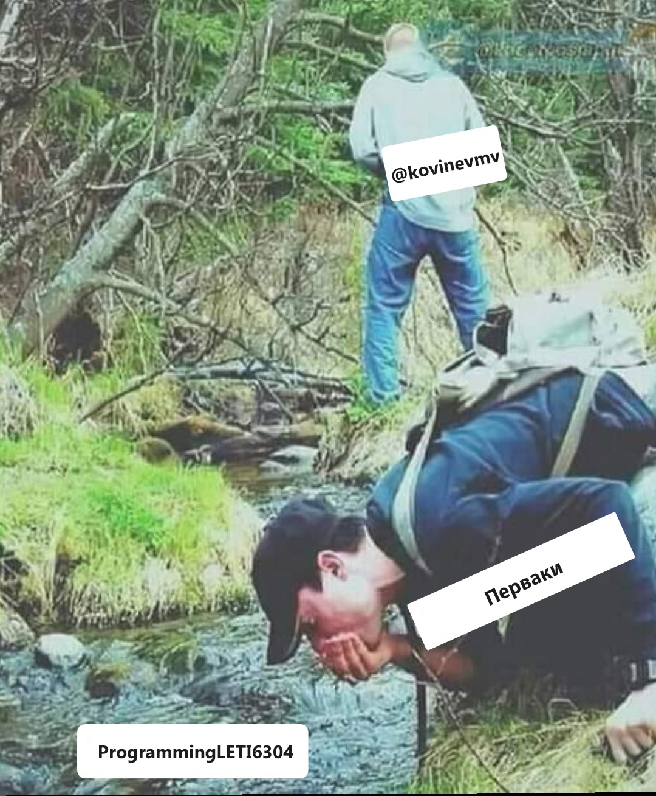

# ProgrammingLETI6304

## Список лабораторных работ:

### 1 семестр:

#### Программирование

1. Создание проекта и работа на GitHub

2. Структуры switch, if-else, for, функции стандартной библиотеки для ввода-вывода

3. Указатели

4. Линейные списки

Курсовая работа: Двулинейные списки

### 2 семестр:

#### Программирование

1. Обзор стандартной библиотеки

2. Моделирование стека

3. Рекурсивный обход директорий

Курсовая работа: Работа с BMP-файлами

### 3 семестр:

#### Алгоритмы и Структуры Данных

1. Напечатать все перестановки заданных *n* различных натуральных чисел (или символов).

2. Заменить в иерархическом списке все вхождения заданного элемента (атома) *x* на заданный элемент (атом) *y*.

3. Содержимое заданного текстового файла *F*, разделенного на строки, переписать в текстовый файл *G*, выписывая литеры каждой строки в обратном порядке. В решении задачи использовать стек.

4. Задано бинарное дерево *b* типа *ВТ* с типом элементов *Elem*. Для введенной пользователем величины *Е* (*var E: Elem*) определить число вхождений элемента *Е* в дерево *b*.

Курсовая работа: Случайные бинарные деревья поиска

### 4 семестр:

#### Построение и Анализ Алгоритмов

1. Квадрирование квадрата. Поиск с возвратом.

2. Нахождение компонент двусвязности графа. (*QGraphicScene*)

3. Нахождение кратчайшего пути между двумя вершинами. (*GraphViz* и *QGraphicScene*)

4. Максимальный поток в сети

5. Алгоритм Кнута-Морриса-Пратта

6. Алгоритм Ахо-Корасик

#### ООП

1. Конструирование объектов

2. Наследование

3. Контейнеры

4. Умный указатель (shared_ptr)

5. Полиморфная логика

#### Java. Летняя практика

* Топологическая сортировка графа

### 5 семестр:

#### Параллельные алгоритмы

1. Процессы в UNIX

2. IPC в UNIX

3. XSI IPC

4. Потоки в UNIX

5. OpenMP
